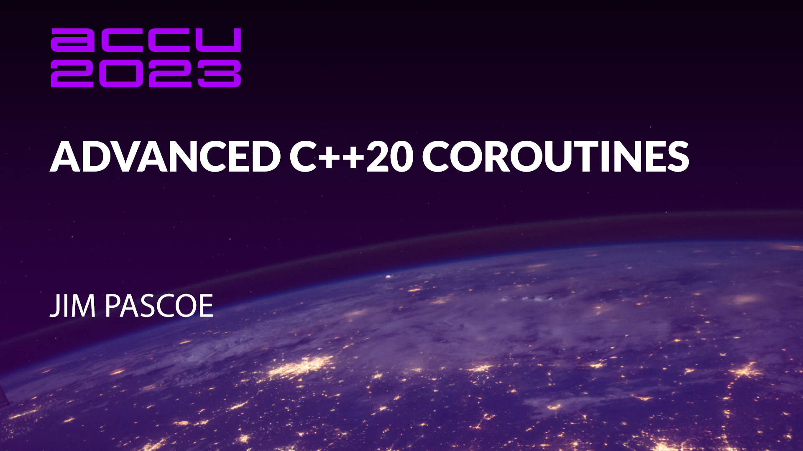

# Applied C++20 Coroutines

The link below refers to [my](http://www.james-pascoe.com) presentation at
[ACCU 2023](https://accu.digital-medium.co.uk/session/applied-c20-coroutines/)
and consists of a link to the online [presentation](http://jamespascoe.github.io/accu2023) and a link
to the [example code](http://github.com/jamespascoe/accu2023-example-code.git). Note
that the presentation is written using the excellent [Reveal.js](https://github.com/hakimel/reveal.js/)
framework.

